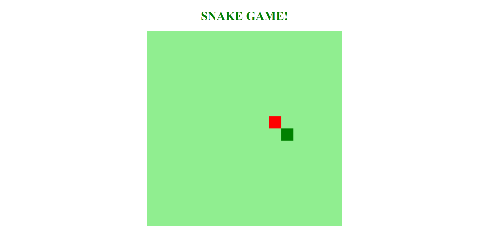

# SnakeGame

Encerramento do bootcamp da DIO.

Desenvolver de forma simples o clássico jogo da cobrinha utilizando HTML, CSS e JavaScript.

## Preview

   

## Run locally

```bash
# Clone this repository
$ git clone https://github.com/vivianemartini/SnakeGame-DIO

# Open folder
$ cd SnakeGame-DIO

# Run the app
$ Open Live Server
```

## License

This project is licensed under the MIT License - see the LICENSE.md file for details
